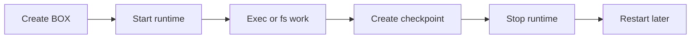

# Mental Model

## Why this matters

If you understand these seven nouns, the rest of `sagens` gets much simpler.

The mistake to avoid is thinking of `sagens` as "just a shell runner." It is closer to a durable unit-of-work system where runtime and state are intentionally separated.

## Copy-paste example

```bash
sagens start
sagens box new
sagens box start <BOX_ID>
sagens box exec <BOX_ID> bash "echo hello"
sagens box checkpoint create <BOX_ID> --name baseline
sagens box stop <BOX_ID>
sagens box start <BOX_ID>
```

## What just happened



- `daemon`: the local control plane. It owns auth, BOX inventory, and runtime orchestration.
- `BOX`: the durable object an agent works inside. A BOX has settings, a workspace, and checkpoint lineage.
- `runtime`: the live microVM for a BOX. It is intentionally ephemeral.
- `workspace`: the durable filesystem state for a BOX. This is why stop and restart do not mean "start over."
- `checkpoint`: a snapshot in the BOX lineage that lets you restore or fork work safely.
- `admin credential`: a daemon-wide credential bundle. It can manage the control plane and all BOXes.
- `box credential`: a BOX-scoped credential bundle. It is meant for an agent that should touch only one BOX.

The practical rule is simple: treat the runtime like compute, treat the workspace like state.

## What to read next

- See the full CLI flow: [CLI quickstart](quickstart-cli.md)
- See the same flow from Python: [Python quickstart](quickstart-python.md)
- See how persistence behaves in practice: [Persistent workspaces](recipes/persistent-workspaces.md)
